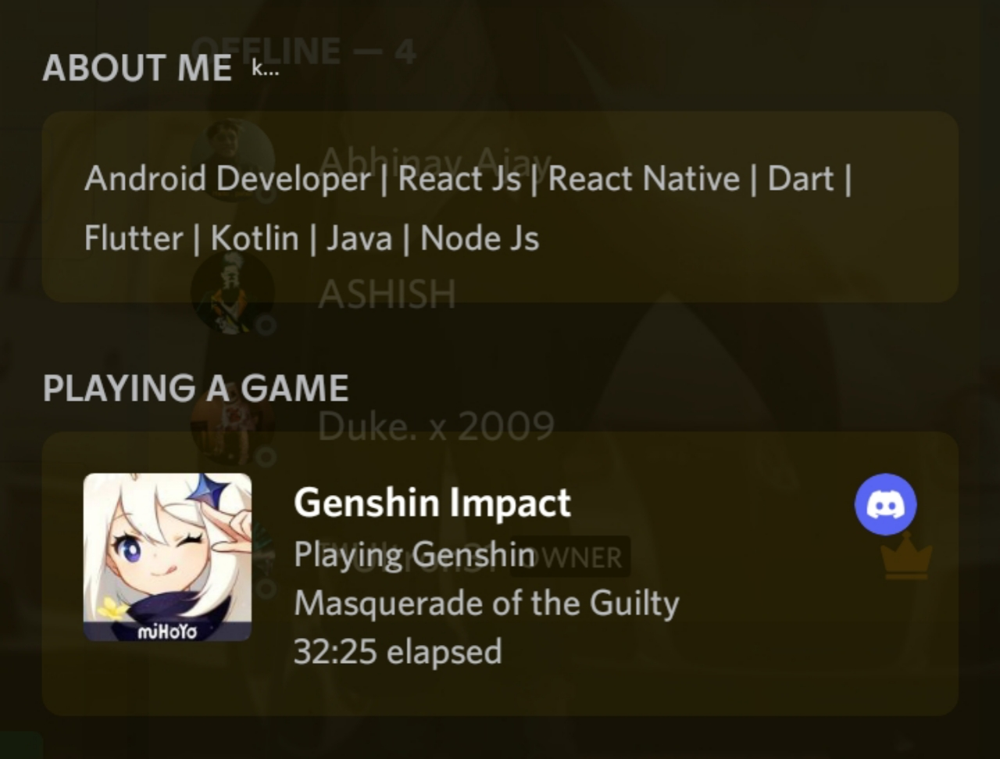

### Discord-Selfbot-RPC


### Features:

- PLAYING, WATCHING, STREAMING ETC RPC
- Custom Status: online, dnd, idle

### FAQ
- **Q: How can I obtain my token?**
- A: 1. [How to obtain your token in android](https://youtu.be/GF_7p-I_hyM) 2. [How to obtain your token in PC](https://youtu.be/aD_gvIEPNXw)

### Installing 

```
node index.js

TOKEN=<Please Enter Your Discord self Token>
Name=<Please Enter Your Rpc Name>
Type=<Please Enter Your Rpc Type Like PLAYING>
ApplicationId=<Please Enter Your Discord Application Client Id>

Url=<Please Enter Your RPC URL>
Details=<Please Enter Your Rpc Details>
State=<Please Enter Your Rpc State>
ImageName=<Please Enter Your Rpc Assect Id>
ImageSmall=<Please Enter Your Rpc Assect Id>

```

### Host By Heroku
<p align="center"><a href="https://heroku.com/deploy?template=https://github.com/MoeZilla/Discord-Rpc-Bot"> </a></p>
 
